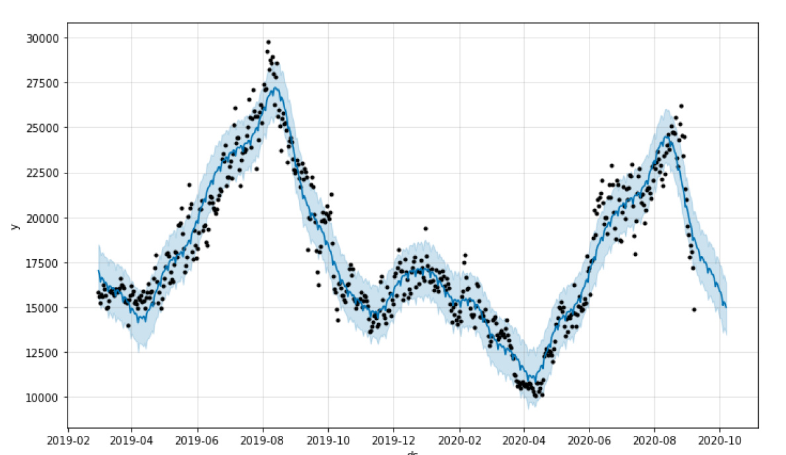
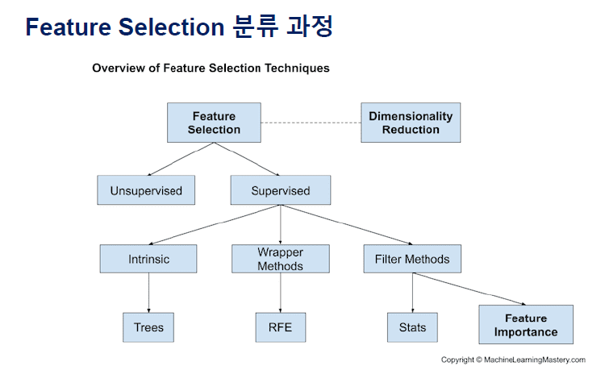

엔트로피가 높으면 정보가 많다 = 불확실성이 크다

엔트로피가 낮다 정보가 적다 불확실성이 작다

검은점 실측

파란라인 예측 

하늘 범위 불확실 범위

목표변수(타깃)은 소문자사용 (흔히)

차원을 줄여서 데이터셋을 만들고 모델을 만들었을때 성능에 얼마나 변화가 있는지를 비교해봐야한다(어떠한 상황이든) 변화 비교

#### 머신러닝에서 일반적 Data Preparation 과정 정리

1. 데이터 준비 과정의 중요성
2. 결측치의 처리방법 
   - (https://gist.github.com/JSJeongme/fdbba476a9cff9400ba32064a92f54e8)
3. 특징 추출 (Recursive Feature Elimination)
   - (https://gist.github.com/JSJeongme/7d6a3f852eb0e9eb451e4c153af6cc6f)
   - classification(분류)은 RFE로 처리가 가능하다(원래는 고유값(eigenvalue)이 큰것으로 컷오프)
4. 데이터 정규화
5. 원 핫 인코딩으로 범주 변환 (One Hot Encoding)
6. 숫자 변수의 범주형 변수로 변환
7. PCA를 통한 차원 축소

 ***Normalization\*** typically means rescales the values into a range of [0,1]. 

(0,1 사이로)

`from sklearn.preprocessing import StandardScaler`

***Standardization\*** typically means rescales data to have a mean of 0 and a standard deviation of 1 (unit variance).

(평균0, 분산1)

딥러닝을 하기전에 standardization을 해줘서 **스케일**을 맞춰줘야한다. (feature Extraction을 스스로 하기 때문에 여러 데이터가 섞일때 문제가 생기지 않게 하기 위하여)

(작은 시그널이 큰 시그널에 묻히는거 방지를 위해서)

pca2 데이터셋 정리

