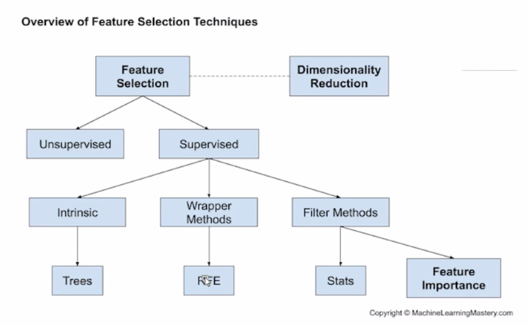

데이터셋을 이해해야지 목표변수를 정할 수 있다.

```mysql
delete tips FROM tips where tips.day = '';

insert into tips (total_bill, tip, sex, smoker, day, time, size) values ('16.99', '1.01', 'Female', 'No', 'Sun', 'Dinner', '2');


```




RFE: 목표변수와 독립변수의 관계로 차원 축소 결정(ANOVA기준)

PCA: 독립변수끼리 차원을 축소할지 결정

​		(pca는 자체적으로 공분산값을 구해서 아이겐벨류값을 얻어서 		그걸 비교해서 위에서 부터 큰값을 리턴한다.. 맞나요?)


target_tip 복습하기

팁이라는 데이터가 있음

데이터를 관리해서 차원을 줄이는 실습을 함


selecto=rfe.fit(datatrans, y)
selecto.support_

RFE 돌려서 독립변수들 중에 목표변수(tips)랑 연관성이 있어보이는 변수와 그렇지 않은 변수를 출력한 결과입니다!
