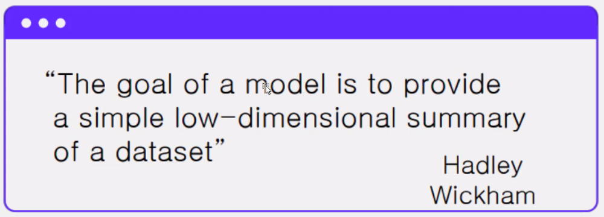
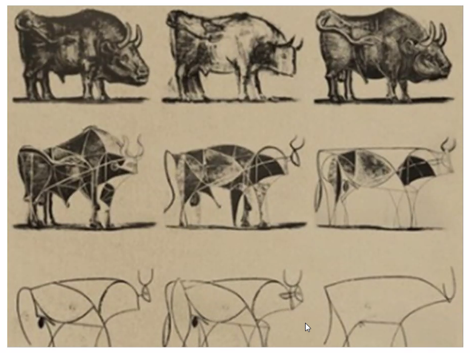
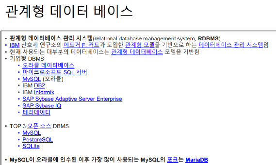
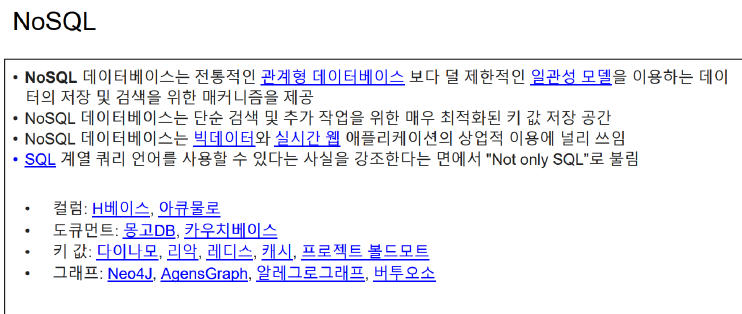

데이터분석의 목적

(데이터의 추상화)

SQL  (데이터를 표로 관리)

NoSQL을 분석후 정리하면 SQL

NoSQL (로그데이터,  데이터를 키+벨류로만 관리)

https://www.samsungsds.com/kr/insights/1232564_4627.html?referrer=https://www.google.com/

콜렉션

SQL보다 양이 훨씬 많음

