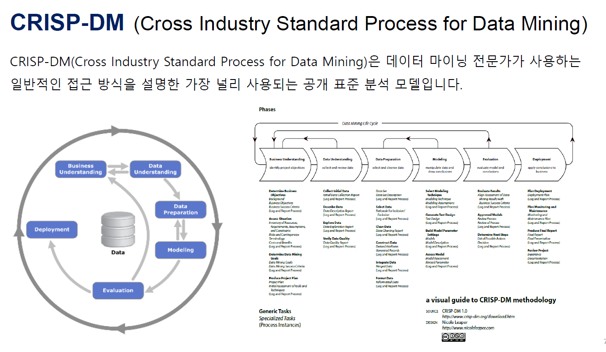

데이터를 다룰시에 해야될 일 

제일 앞장에 스타팅 포인트와 

내가 여기서 어느 부분의 일을 하는지 기록, 인지해야한다.

machine ethics 

기계학습의 편향이 생기는 현상

도메인놀리지

파생변수는 편견에 조심해야함

모델의 학습능력 향상에 도움이 되는 파생변수를 알아야한다.

데이터사이언스 방법론

범주분류 기준 된 수^(분류될 객체들)

컬럼^로우 

방법론

데이터 변수 타입 분류

파생변수

엔코딩하는법 (원핫엔코딩, 라벨엔코딩)

피어슨 변수간 관계가 이니얼(선형관계)때 사용

스피어맨 변수간 관계가 넌이니얼(비선형관계)때 사용

하나의 독립변수, 독립변수에 내부에 변수(ㄹ벨이 3개 이상)각 라벨을 비교하여 관계를 찾는것 = ANOVA

여러 독립변수, 내부에 여러 라벨 = chi-squared

### 가설검증

- ANOVA 
  - 1개의 column안에 3개 이상의 라벨이 있을때

- Chi-squared
  - 여러개의 column이 있을때

##### 모델의 학습셋을 준비하는 과정이 핵심(좋은 학습셋)

